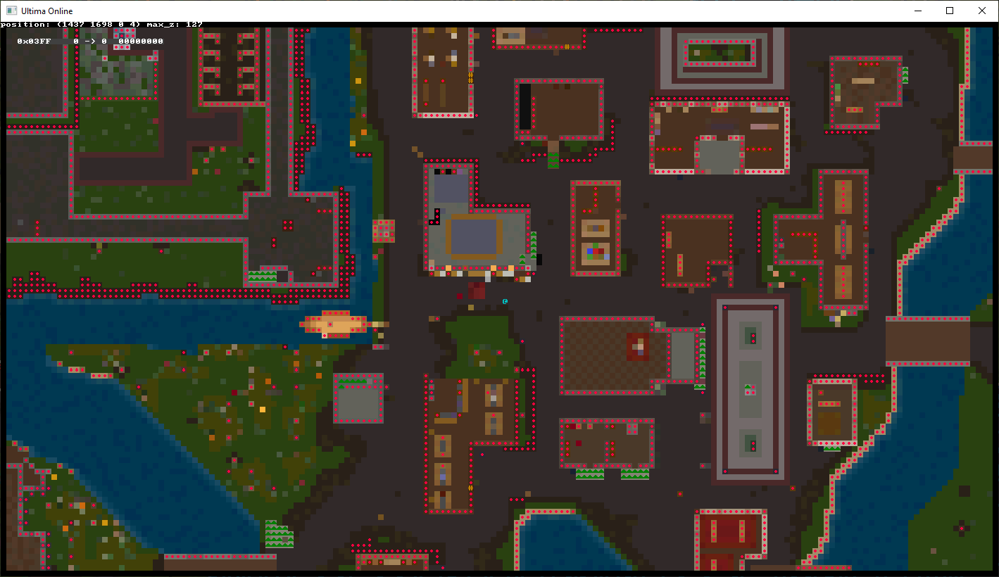
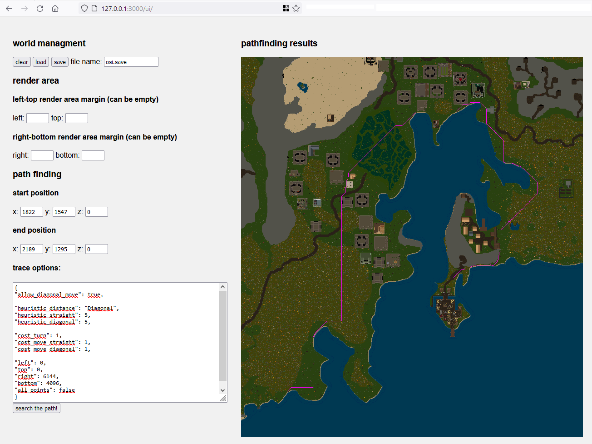

# Pathfinding Server for Ultima Online

Simple world browser

Web-ui available at  <http://127.0.0.1:3000/ui/>

## Short description

This program is designed to finding paths in Ultima Online.

It allows you to search paths taking into account various game items.

Using the [http json api](src/http/API.md) at <http://127.0.0.1:3000/api/> you can add this data about these objects using clients such as Orion or Stealth, with the ability to save and load the state of the world later.

Of course, api provides the ability to calculate paths between any point in the world, with the ability to fine-tune the parameters.

And additionally, you can render part or all of the world map and display the path found on it in png format.

There is a simple graphical interface for exploring the world, controlled by `arrows`, `ctrl` and `left shift` keys and mouse.

## Dynamic Library

In addition to the standard application, the path server can be compiled as a dynamic library. The library provides all the functionality except for the GUI.

The library must be initialized after loading by calling the `start_path_server` function, further interaction occurs through the http api

## Building and launch

To compile, just clone the repository and run `cargo build -r`
Of course, for this, the [Rust](https://www.rust-lang.org/tools/install) compiler must be installed for your operating system.

To run the program, the current directory must contain files
`www/ui.htm`
`www/terminal_8x8.png`
`Radarcol.mul`
`Statics0.mul`
`Map0.mul`
`Staidx0.mul`
`Map2.mul`
`Statics2.mul`
`Staidx2.mul`
`multi.idx`
`multi.mul`
`tiledata.mul`
 
Or unzip the file with the release to the Ultima Online client folder.
